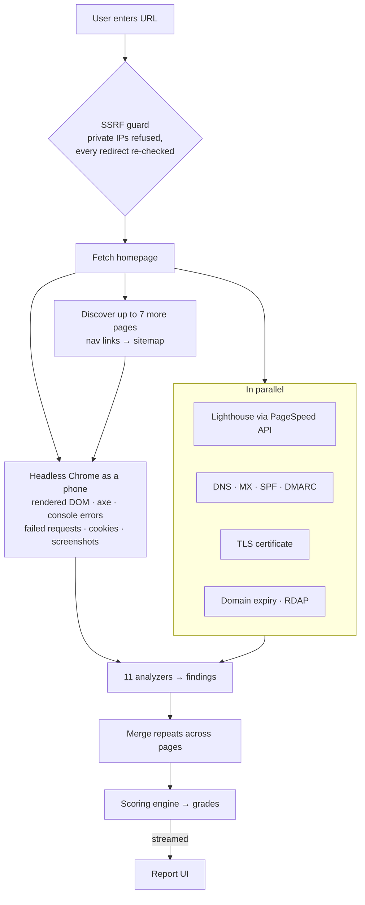

# SiteScore

**Paste a website address and get a graded health report in about 30 seconds**, covering security, SEO, speed, accessibility, mobile, content and technical health. Built for small-business owners: each of the seven areas is framed as the question they'd actually ask (*"Can visitors trust it?"*, *"Does it work on a phone?"*).

> 🔒 **Source is private.** This repo documents the project: what it does, how it's built, and the engineering decisions behind it. Happy to walk through the code in an interview.

---

## At a glance

| | |
|---|---|
| **Size** | ~7.8k lines of TypeScript |
| **Analyzers** | 11: security, SEO, performance, accessibility, mobile, content, technical, infra, crawl, rendered DOM, quality |
| **Data sources** | Rendered DOM (headless Chrome), axe-core, Google Lighthouse (PageSpeed API), DNS, TLS, RDAP |
| **Tests** | Vitest suites incl. SSRF, redaction, scoring and a fix-loop test that verifies every recommended fix |
| **Output** | Streaming progress → first report → final report with Lighthouse numbers; PDF export |

## How a scan works

## Engineering decisions worth talking about

**Security first: SSRF protection.** A service that fetches arbitrary user-supplied URLs is a classic SSRF target. Every request, *including every redirect hop*, is checked against private and internal address ranges, and this has its own test suite.

**Streaming UX.** A full scan takes time (a real browser, up to 8 pages, a Lighthouse run), so progress streams to the browser. The user gets a first report as soon as the local analysis finishes, then the final one when Lighthouse returns.

**Real rendering, not just HTML parsing.** Pages load in headless Chrome as a mobile visitor, so findings reflect what users actually see: client-rendered content, runtime console errors, failed network requests and third-party tracking cookies.

**Fixes are tested, not guessed.** The fix-loop test generates a page that has each problem, asserts it gets flagged, applies the recommended fix's own code snippet, and asserts the finding clears. A companion script does the same against live sites, reporting what cleared, what didn't, and what the fix introduced.

**De-duplication across pages.** The same issue on eight pages is one finding with eight locations, not eight findings. Scores reflect the site, not page count.

**Concurrency control.** Concurrent headless-browser scans are capped (configurable) so the host can't be overwhelmed.

## Status

Feature-complete as a product. The remaining work is hosting: moving report storage from local disk to a real store, and deploying to a host that can run Chrome.

---

Built by <a href="https://github.com/moezkayy">@moezkayy</a>.
