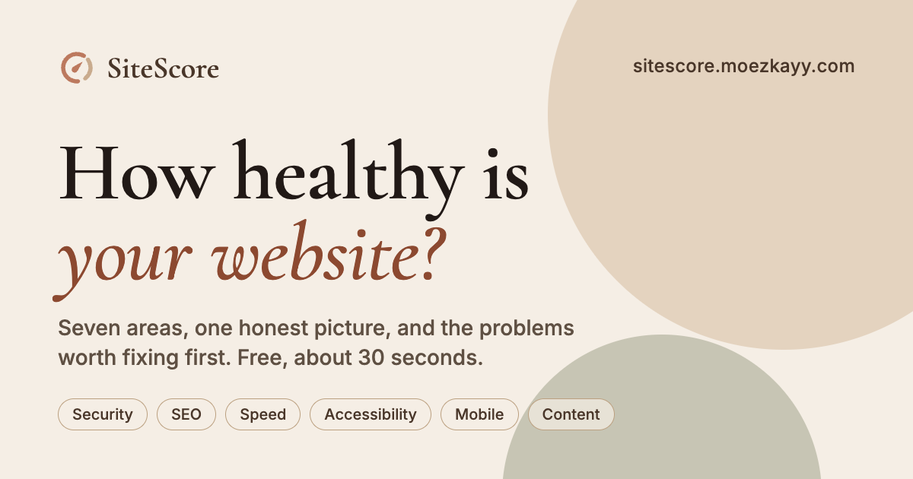
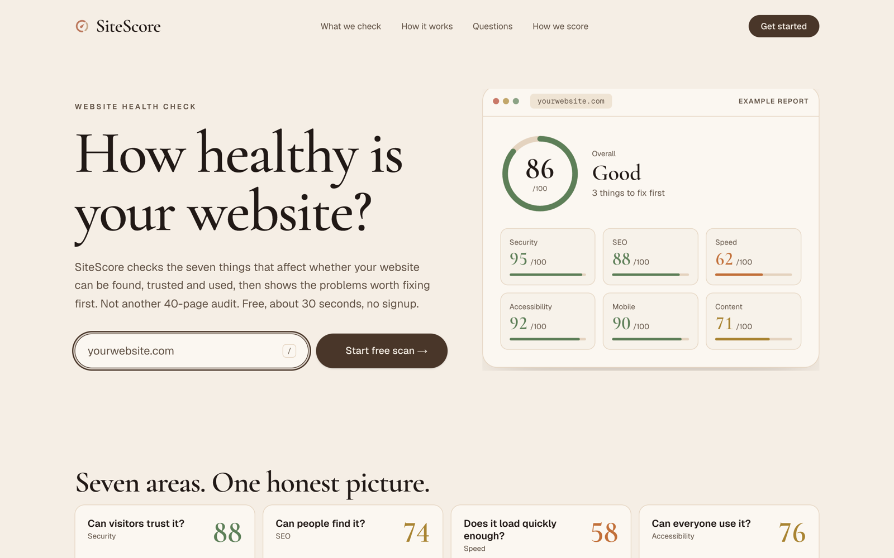
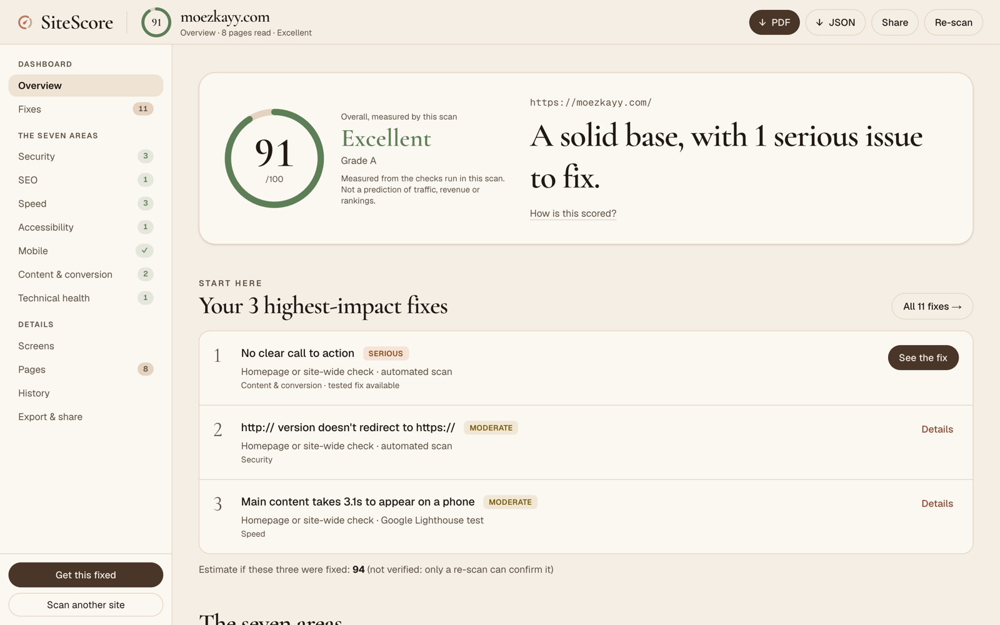
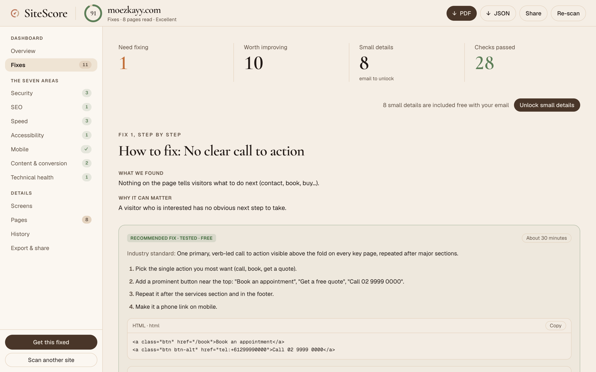
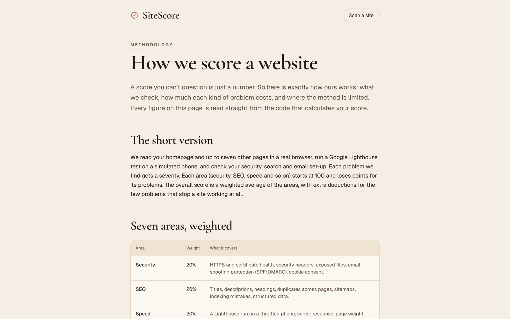
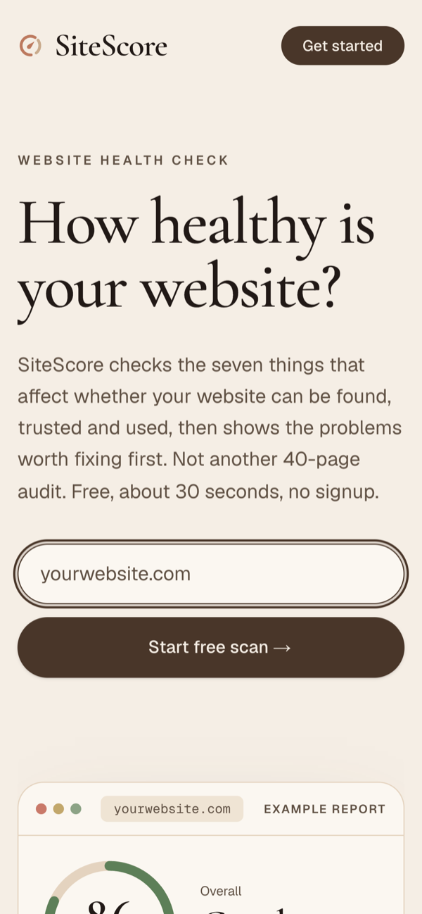
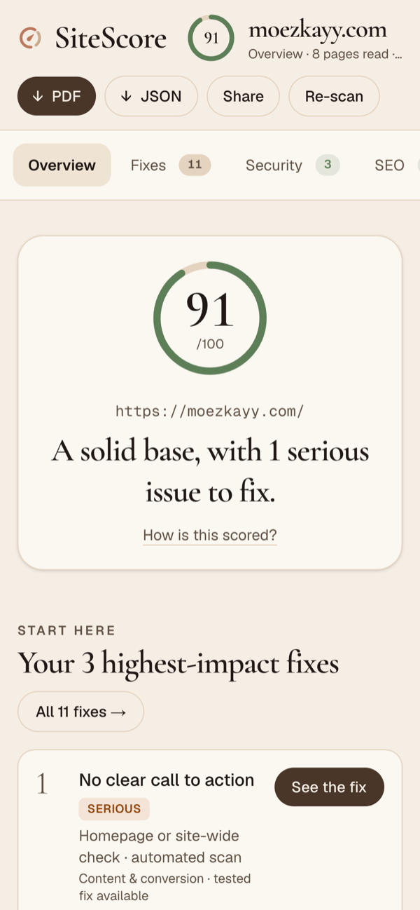
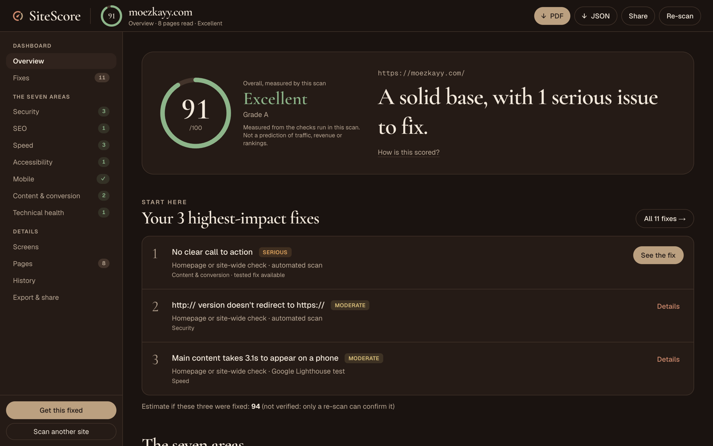
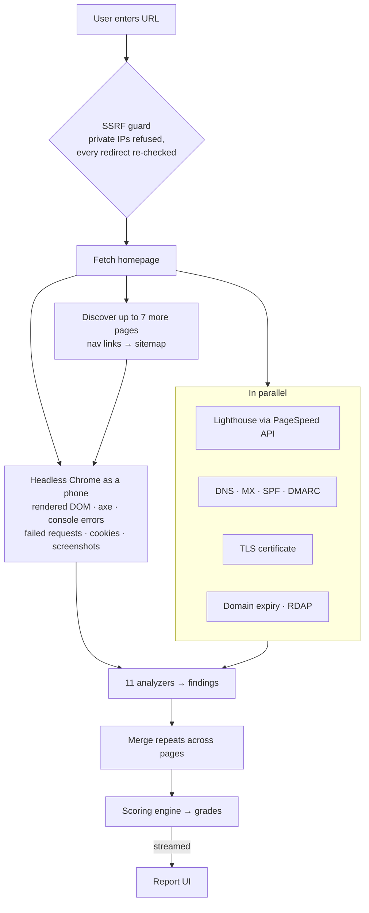

# SiteScore

**Paste a website address and get a graded health report in about 30 seconds**, covering security, SEO, speed, accessibility, mobile, content and technical health. Built for small-business owners: each of the seven areas is framed as the question they'd actually ask (*"Can visitors trust it?"*, *"Does it work on a phone?"*), and every problem comes with a fix that has been tested in code.

> 🔒 **Source is private.** This repo is the public face of the project: what it does, how it looks, how it's built and the engineering decisions behind it. I'm happy to walk through the code in an interview.

---

## At a glance

| | |
|---|---|
| **Size** | ~7.5k lines of TypeScript (app + tests) |
| **Analyzers** | 11: security, SEO, performance, accessibility, mobile, content, technical, infra, crawl, rendered DOM, quality |
| **Data sources** | Rendered DOM (headless Chrome), axe-core, Google Lighthouse (PageSpeed API), DNS, TLS, RDAP |
| **Tests** | 113 tests across 12 Vitest suites, incl. SSRF, redaction, scoring and a fix-loop that verifies every recommended fix |
| **Output** | Streaming progress → first report → final report with Lighthouse numbers; PDF, JSON and share-link export |

## The product

### The report
A dashboard rather than a 40-page audit. The overall grade, one plain-English verdict, and the three fixes that will move the score most, with an estimate of the score once they're done.

### Fixes, step by step
Every finding says what was found, why it matters, and how to fix it: numbered steps, a time estimate and a copy-ready code snippet. Each snippet is checked by the test suite (see below).

### Transparent scoring
A public methodology page explains exactly how scores are calculated. Its numbers are read straight from the scoring code, so the page and the engine can't drift apart.

### Mobile-first and dark mode

<table>
<tr>
<td width="25%"></td>
<td width="25%"></td>
<td width="50%"></td>
</tr>
</table>

## Design

A warm, editorial look chosen deliberately to stand apart from the usual blue-and-grey SaaS dashboard: it reads like a trusted adviser's report, not a monitoring tool.

- **Type:** Cormorant Garamond for display headings, Geist for UI text, Geist Mono for URLs and code.
- **Colour:** a token-based palette (`--background`, `--surface`, `--accent`, plus one token per severity) defined once in CSS and mapped into Tailwind v4. Dark mode swaps the tokens and nothing else.
- **Accessible by construction:** severity chips use darker "ink" variants so small labels reach 4.5:1 contrast on their own tinted backgrounds. The tool that grades accessibility had to pass its own checks.
- **Brand system:** a custom logo mark (full colour, one-colour and reversed), app icons, and generated Open Graph / Twitter cards.

| Token | Light | Dark |
|---|---|---|
| Background | `#f5eee5` | `#1a1310` |
| Foreground | `#211916` | `#f3e9dc` |
| Accent | `#493629` | `#bba080` |
| Brand | `#bc795e` | `#d08b6e` |
| Good · Moderate · Serious · Critical | `#5d7f58` · `#a98432` · `#c2703a` · `#b4432f` | `#8db58a` · `#d9bf7a` · `#e0a45e` · `#e5806a` |

## How a scan works

### Scoring model
Each area starts at 100 and loses points according to the severity of its findings. The overall score is a weighted average, with extra deductions for the few problems that stop a site working at all.

| Security | SEO | Speed | Accessibility | Mobile | Content | Technical |
|:-:|:-:|:-:|:-:|:-:|:-:|:-:|
| 20% | 20% | 20% | 15% | 10% | 10% | 5% |

## Engineering decisions worth talking about

**Security first: SSRF protection.** A service that fetches arbitrary user-supplied URLs is a classic SSRF target. Every request, *including every redirect hop*, is checked against private and internal address ranges, and this has its own test suite.

**Streaming UX.** A full scan takes time (a real browser, up to 8 pages, a Lighthouse run), so progress streams to the browser. The user gets a first report as soon as the local analysis finishes, then the final one when Lighthouse returns.

**Real rendering, not just HTML parsing.** Pages load in headless Chrome as a mobile visitor, so findings reflect what users actually see: client-rendered content, runtime console errors, failed network requests and third-party tracking cookies.

**Fixes are tested, not guessed.** The fix-loop test builds a page that has each problem, asserts it gets flagged, applies the recommended fix's own code snippet, and asserts the finding clears. A companion script does the same against live sites, reporting what cleared, what didn't, and what the fix introduced.

**De-duplication across pages.** The same issue on eight pages is one finding with eight locations, not eight findings. Scores reflect the site, not page count.

**Gating enforced on the server, not hidden in the UI.** Email-locked findings are stripped from the response before it leaves the server (only counts are sent), so they can't be read out of the page data. This has its own test suite.

**Evidence-based re-scans.** Comparing two scans of the same site reports exactly what was resolved, what's new and what remains. "Resolved" means one real scan flagged it and a later one didn't; it isn't a guess.

**Concurrency control and rate limiting.** Concurrent headless-browser scans are capped (configurable), and a per-IP limiter returns 429 so the tool can't be used as a free crawler.

**Built as a product, not a demo.** Beyond the scanner: email-gated "small details", lead capture behind a "Get this fixed" button, first-party event tracking, scan history, an SEO-ready sitemap and robots file, and social share images.

## Status

Feature-complete as a product. The remaining work is hosting: moving report storage from local disk to a real store, and deploying to a host that can run Chrome.

---

Designed and built by <a href="https://github.com/moezkayy">@moezkayy</a> · <a href="https://moezkayy.com">moezkayy.com</a>
